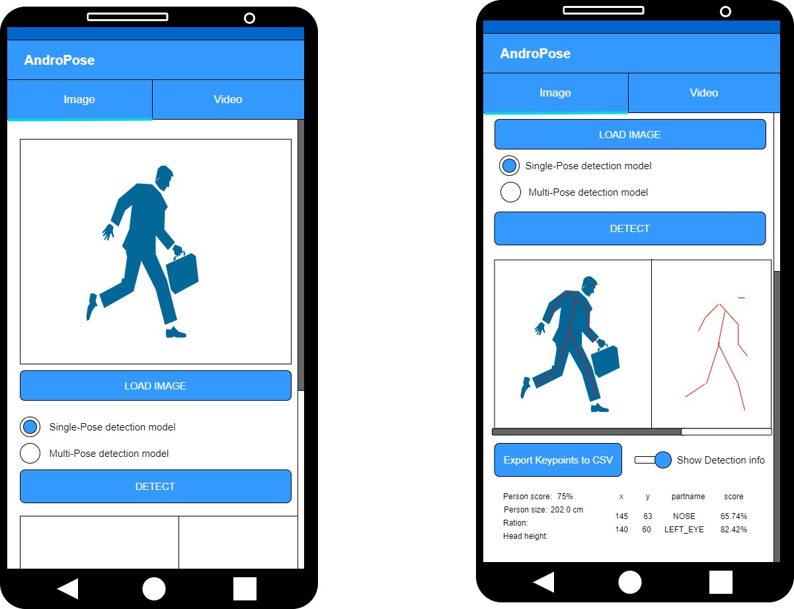

# AndroPose V3 with new features

## Design

 

### What's new?
- Test pose inference on images or videos with __differents models__
-- PoseNet's Single Pose model
-- Combine SSD MobileNetV1 + Single Pose model of PoseNet for testing multi-persons pose tracking
-- PoseNet's Multi-persons Pose tracking model
- Set the __number of persons to be tracked__ using PoseNet's multi-persons pose estimation model.
- __Summarize pose inference__ displaying, the key points positions in the image, the name of the body part found and its confidence score.
- __Infere person's height__ using the golden ratio proportion approach.