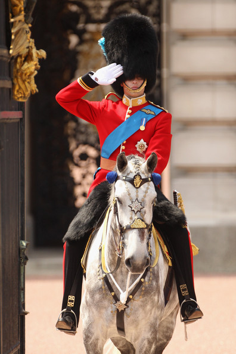
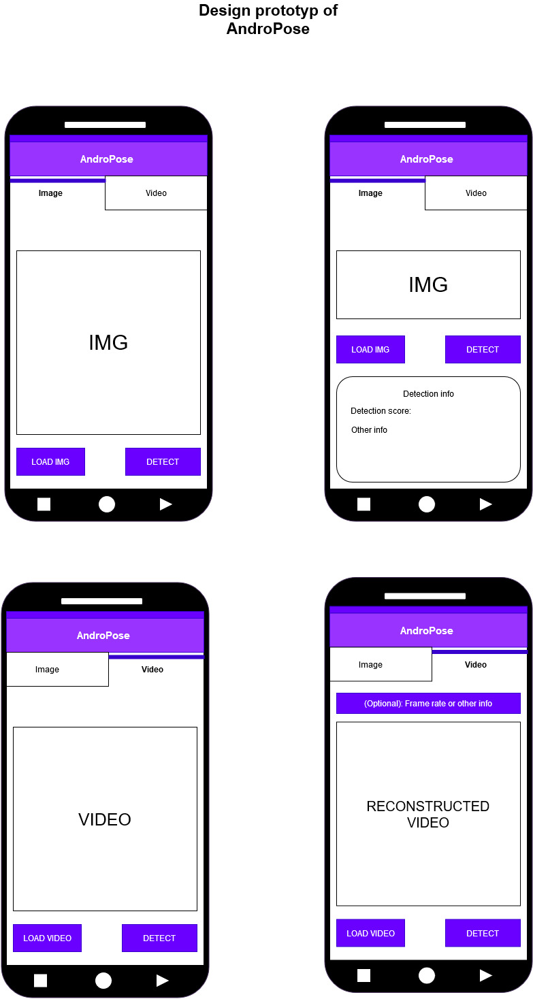
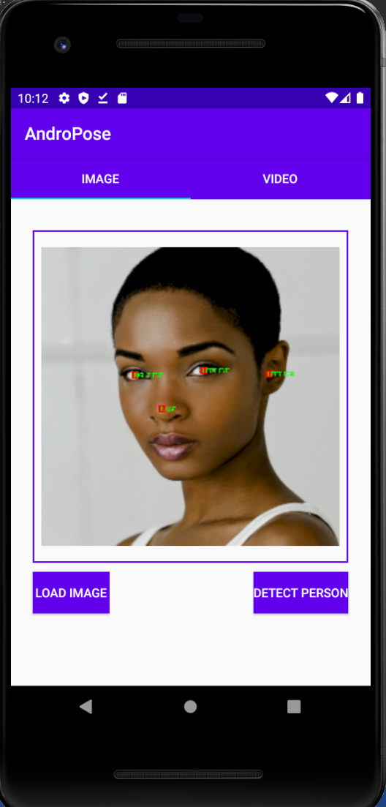
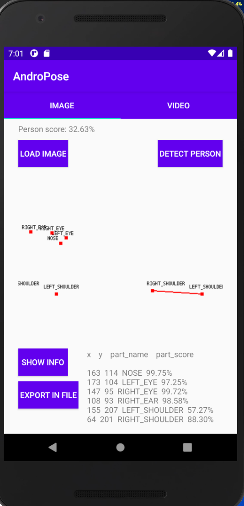

This repository presents an university project done with a classmate for single/multi person detection in images and videos on android devices.

The code for the the single person ist based on the tensorflow lite example code (https://github.com/tensorflow/examples/tree/master/lite/examples/posenet/android) and the code of the multiperson detection is based on the tensorflow lite flutter plugin code (https://github.com/shaqian/flutter_tflite/tree/master/android, https://medium.com/flutter-community/posenet-for-ios-android-and-flutter-using-tensorflow-lite-836788a110c7 ).

# AndroPose
Human pose estimation for (android) mobile device

## 1. Pose estimation in image

- Original image

 

- After estimating pose using tflite

 

 

## 2. PoseEstimation in Video

 

 

## 3. New design (AndroPose 2.0): coming soon

The version 3.0 of AndroPose is already available [here](./AndroPose-V3.md)

 

 

 

### 3.1 Application test on new design

 

 

Display image reconstruction

 

 
