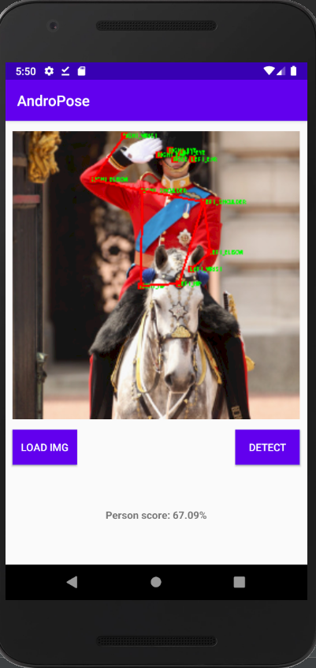

# AndroPose
Human pose estimation for (android) mobile device

## 1. Pose estimation in image

- Original image

 

- After estimating pose using tflite

 

 

## 2. PoseEstimation in Video

 

 

## 3. New design (AndroPose 2.0): coming soon

The version 3.0 of AndroPose is already available [here](./AndroPose-V3.md)

 

 

 

### 3.1 Application test on new design

 

 

Display image reconstruction

 

 